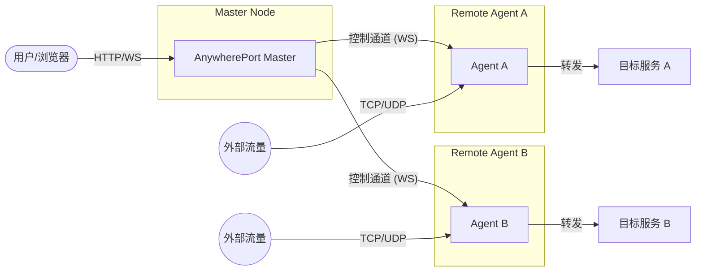

# AnywherePort

AnywherePort 是一款基于 Go 语言开发的轻量级、高性能分布式端口转发工具。它采用 Master-Agent 架构，通过 WebSocket 建立稳定的控制双向通道，可轻松实现多节点流量转发与统一管理。

## 🌟 核心特性

- **🚀 高性能转发**: 基于 Go 原生网络库，支持 TCP 和 UDP 流量的高效转发。
- **🏗️ 分布式架构**: 单个 Master 可管理多个 Agent 节点，支持跨网络环境部署。
- **📊 Web 管理面板**: 提供友好的网页操作界面，实时查看节点状态并管理转发规则。
- **🛡️ 灵活认证**: 内置安全认证机制，支持 Token 校验，确保 Master 与 Agent 之间的通信安全。
- **📦 零依赖部署**: 静态资源全内置，二进制文件即下即用，无需额外安装运行环境。

## 🛠️ 技术架构

AnywherePort 由两个核心组件组成：

1.  **Master (控制端)**: 负责全局配置管理、Web UI 展示、API 接口提供以及与各 Agent 的协调通信。
2.  **Agent (节点端)**: 部署在流量出入口，根据 Master 指令执行实际的端口监听与数据转发任务。



---

## 🚀 部署指南

本指南详细说明了 AnywherePort 的生产环境部署流程。

### 1. Master (服务端) 部署

Master 负责 Web 管理界面、认证以及协调各 Agent 节点。

#### 1.1 所需文件

| 文件 | 说明 |
| :--- | :--- |
| **`awport-master`** | 主程序二进制文件 (Windows 为 `.exe`) |
| **`config.yml`** | 配置文件 (需与程序同级) |

> **注意**: Web 静态资源已打包进二进制文件，**无需**额外部署其他目录。

#### 1.2 `config.yml` 配置示例

```yaml
# Web 管理面板监听地址
web_addr: ":9090"

# 外部可达地址 (需包含协议) - 用于自动生成 Agent 连接脚本
public_addr: "http://your-ip-or-domain:9090"

# 数据存储目录 (默认为 ./data)
data_dir: "./data"

# 管理员认证配置
auth:
  username: "admin"
  password: "YourStrongPassword" # 请务必修改默认密码
```

#### 1.3 启动命令

**Linux:**
```bash
nohup ./awport-master > master.log 2>&1 &
```

**Windows:**
```powershell
.\awport-master.exe
```

---

### 2. Agent (客户端) 部署

Agent 负责实际的流量转发，部署在目标机器上。

#### 2.1 启动流程

1.  **获取凭据**: 登录 Master Web 界面 -> "节点管理" -> "添加节点" -> 获取 `Agent ID` 和 `Token`。
2.  **启动命令**:
    - **Linux**: `nohup ./awport-agent -master <MasterIP>:9090 -id <ID> -token <Token> > agent.log 2>&1 &`
    - **Windows**: `.\awport-agent.exe -master <MasterIP>:9090 -id <ID> -token <Token>`

> **提示**: Master Web 界面在添加节点后会提供一键启动脚本（基于 curl 或 PowerShell），推荐直接复制执行。

---

## 💻 本地开发

如果你想自行编译或进行二次开发：

1. 克隆仓库: `git clone https://github.com/frazy/anywhere-port.git`
2. 安装依赖: `go mod tidy`
3. 编译 Master: `go build -o awport-master ./cmd/master`
4. 编译 Agent: `go build -o awport-agent ./cmd/agent`

---

## 📝 常见问题 (FAQ)

- **数据持久化**: 数据保存在 `data/` 目录，包括节点信息和统计数据。
- **防火墙**: 确保开放了 Master 的 Web 端口（默认 9090）以及所需的转发端口。
- **通信协议**: 内部采用 WebSocket，确保网络环境不阻断该协议。

---

## 📄 开源协议

[MIT License](LICENSE)
